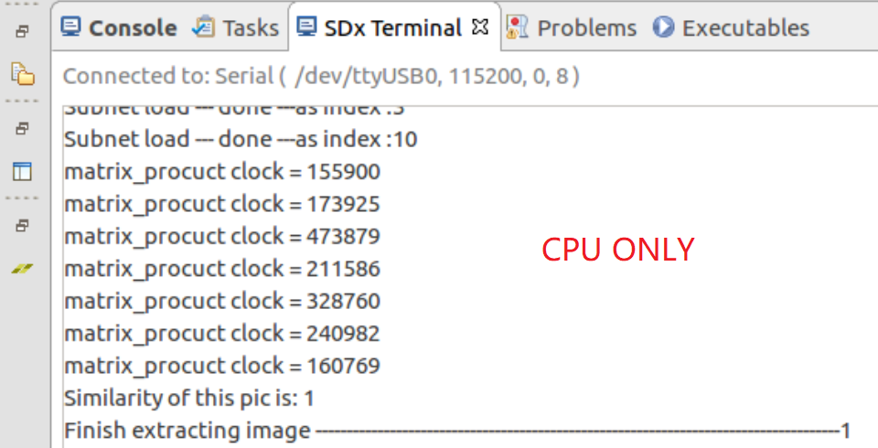

# 【超详细教程】
原创教程，转载请联系作者并注明出处：<https://github.com/WalkerLau>

最近发现很多小伙伴都想用FPGA加速卷积神经网络运算，而恰好我刚做完的本科毕设就是这个题目，所以就有了写这个教程的想法，希望能给还没开始的小伙伴一点思路与帮助，更希望大神们给出一些进一步优化的建议。

## 最终加速性能
话不多说，先看最终的加速效果。本加速系统仅加速卷积层的运算，相比于4核ARM A53处理器可以平均加速50倍。下图展示了**仅采用CPU**和**采用CPU+FPGA加速系统**来处理VIPLFaceNet人脸识别算法时，计算7个卷积层所耗费的时钟数的对比。

chg pic待添加。

## 项目描述及特点
本加速系统采用中科院计算所的[SeetaFace](https://github.com/seetaface/SeetaFaceEngine)人脸识别项目进行加速功能的验证，所用的卷积神经网络模型是VIPLFaceNet。本项目的设计工具是Xilinx SDSOC，个人认为这是个人或小团队进行FPGA嵌入式开发最高效的工具，因此不会涉及HDL的编写。本加速系统具有以下特点：

* 容易移植：本项目采用Xilinx SDSOC进行设计，可以直接把C/C++代码综合成FPGA电路，只需修改FPGA加速模块的代码中卷积层结构相关的参数就可以移植到别的卷积神经网络算法中。
  
* 高性能，采用了如下几种加速策略，具体原理见最后一节：
  
  * 独创的输入体复用架构
  
  * 数据的低精度转换
  
  * 16通道并行计算单元及加法树结构
  
  * 流水线策略
  
  * 片上存储BRAM的partition及卷积层间共享
  
  * 多层卷积的加速实施策略
  
## 你需要准备什么？
* 硬件：
  * Xilinx Ultrascale+ MPSOC ZCU102 (也可以用ZCU104或其他合适的Xilinx嵌入式开发板)
  
* 软件：
  * Ubuntu 16.04 操作系统（用于安装和运行SDSOC，由于后面需要编译板载Linux系统，必须使用Linux主机不能用Windows，以下所有开发都在Linux环境中进行）
  
  * Xilinx SDSOC 2018.2 开发套件（戳这里的[SDSOC安装及配置教程](http://blog.eetop.cn/blog-1674693-6943425.html?_dsign=c2e07c0d)，请务必跟教程走）

  * Xilinx reVISION platform（由于SeetaFace的小部分代码用到了OpenCV，这里安装reVISION是为了使用里面的xfopencv库，上一项的SDSOC安装教程详细讲了reVISION的安装与使用方法）
  
  * [可选，建议安装] CodeBlocks（用于对算法程序进行离板调试）
  
  * [可选，建议安装] 安装OpenCV 2.4.13.6（SeetaFace的小部分代码用到了OpenCV，用于对算法程序进行离板调试）

* 一些基本知识：
  * 虽然在上面的[SDSOC安装及配置教程](http://blog.eetop.cn/blog-1674693-6943425.html?_dsign=c2e07c0d)的最后一节中已经提到过SDSOC的官方使用教程和相应的手册，还是要强调一下这个教程的重要性，它写的很好可以快速带你入门SDSOC，请跟着教程了解SDSOC后再阅读以下内容。
  
  * 基本的 C/C++ 知识。 

## 项目安装流程
1. 下载本项目文件夹。
   
2. 创建SDSOC项目并配置编译环境，具体步骤请戳[SDSOC安装及配置教程](http://blog.eetop.cn/blog-1674693-6943425.html?_dsign=c2e07c0d)，查看其中第二节的“工程配置”及“设置编译选项”两个小节。

3. 把 `src` 文件夹中的所有代码文件添加到SDSOC项目。这里想说一下的是，`src` 中的代码文件是SeetaFace的源码的FPGA加速版，我把SeetaFace的所有源码都集中到这一个文件夹里了。项目的顶层main函数在 **test_face_recognizer.cpp** 文件中，若你想直接查看底层经过FPGA加速优化的卷积层运算代码，可以直接跳到 **conv_net.cpp** 文件。

4. 然后在SDSOC的project explorer窗口找到 **convolute1.cpp** 并展开，如图在带绿点的convolute1上右键，选择“Toggle HW/SW”；同样地，再找到 **math_functions.cpp** 并展开，在带绿点的matrix_procuct上右键，选择“Toggle HW/SW”。Toggle HW/SW 是把函数标记为硬件函数，硬件函数将被放进FPGA进行处理。Toggle完了以后可以在项目设置窗口看到有两个函数被标记为了硬件函数。
   
    
   

5. 在项目设置窗口（Application Project Setting）勾选Generate SD card image后，就可以准备编译了。在SDSOC左下角的assistant窗口，选中之前根据教程配置好的编译环境（图中显示的是Seeta，但它和教程中修改的release配置是一样的），点击上方的锤子图片进行编译。本项目的编译一般需要1~3个小时。
   
   

   
   

6. 编译结束后，在SDSOC项目文件目录中导航到与编译环境同名的文件夹（我这里是`Seeta`，若你跟教程走的话就是`release`），在里面找到`sd_card`文件夹，把里面的所有文件复制到SD卡根目录，准备下板。
   
   

   
   

7. 把本项目文件中 `model` 和 `data` 两个文件夹也拷贝到SD卡的根目录。

8. 根据[SDSOC安装及配置教程](http://blog.eetop.cn/blog-1674693-6943425.html?_dsign=c2e07c0d)第二节中“配置 uart”小节的指导，完成下板操作并查看加速效果。 

## 离板调试
我们在上面介绍了本项目的安装流程，其中所有的代码都将在FPGA开发板上运行。但假如你要修改本项目的代码或把本项目的FPGA加速方法移植到其他算法中，你就需要对代码进行离板调试。离板调试仍然需要在Linux环境中进行。

1. 下载[OpenCV 2.4.13.6](https://opencv.org/releases/)，并安装（[OpenCV安装教程](https://docs.opencv.org/master/d7/d9f/tutorial_linux_install.html)）。

2. 安装codeblocks，创建工程项目，然后配置OpenCV环境（[codeblocks中OpenCV的配置教程](https://blog.csdn.net/goomaple/article/details/45642499)，可直接跳到该教程的第六步。注意，这个教程不是我写的，它调用的是适配于Visaul Studio的lib，而我们要用的是之前自己安装的lib，添加路径和lib文件的时候要注意这点）。 

3. SeetaFace源码用到了C++11标准，所以还要在codeblocks的build option中勾选对c++11的支持。
   
4. 复制 `off-board debug` 文件夹中的两个 .cpp 文件，粘贴到 `src` 文件夹并替换掉其中的两个同名 .cpp 文件，然后把 `src` 文件夹的所有代码文件导入codeblocks的工程中。

5. 编译工程并运行。

## 致谢
衷心感谢西安电子科技大学王树龙老师和高全学老师对本项目的指导与支持。
